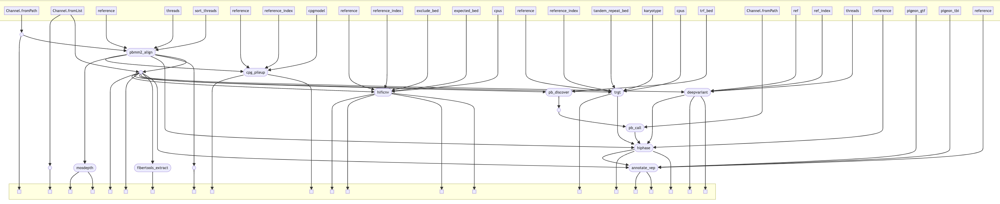

[Nextflow](https:///www.nextflow.io/) secondary analysis pipeline for the analysis of [PacBio HiFi reads](https:///downloads.pacbcloud.com/public/revio/2022Q4/?utm_source=Website&utm_medium=webpage&utm_term=HomoSapiens-GIAB-trio-HG002-4&utm_content=datasets&utm_campaign=0000-Website-Leads). Processes that comprise the pipeline include [read alignment](https:///github.com/PacificBiosciences/pbmm2), [variant calling](https:///github.com/google/deepvariant/blob/r1.6.1/docs/deepvariant-pacbio-model-case-study.md), [copy number](https:///github.com/PacificBiosciences/HiFiCNV?tab=readme-ov-file) & [structural variant](https:///github.com/PacificBiosciences/pbsv) calling, [tandem repeat genotyping](https:///github.com/PacificBiosciences/trgt), [variant annotation with VEP](https://github.com/Ensembl/ensembl-vep), [genotype phasing](https://github.com/PacificBiosciences/HiPhase), [5mC CpG calling](https://github.com/PacificBiosciences/pb-CpG-tools), [6mA calling](https://fiberseq.github.io/fibertools/extracting/extract.html), and [read depth analysis](https:///github.com/brentp/mosdepth). 


 Process  | Description | Input | Output | File results
|-----------------|-----------------|-----------------|-----------------|-----------------|
| [pbmm2](https:///github.com/PacificBiosciences/pbmm2)      | Aligned reads to reference genome    | Unaligned BAM file    | Aligned BAM file       | \*.bam; *.bam.bai |
|  [DeepVariant](https:///github.com/google/deepvariant/blob/r1.6.1/docs/deepvariant-pacbio-model-case-study.md)     | SNVs and INDEL variant calling    | Aligned BAM file; reference genome  | VCF file with genotypes     | \*.vcf.gz; \*.vcf.gz.tbi; \*.g.vcf.gz \*.g.vcf.gz.tbi |
| [HiFiCNV](https:///github.com/PacificBiosciences/HiFiCNV?tab=readme-ov-file)   | Copy number variant calling    | Aligned BAM file; BED file of expected CNV regions   | VCF with copy number genotypes; bigWig file of read depth; BEDgraph file with copy number values for genomic intervals   | hificnv.\*.vcf.gz hificnv.\*.depth.bw hificnv.\*.copynum.bedgraph hifi.log |
| [pbsv discover](https:///github.com/PacificBiosciences/pbsv)    | Structural variant (SV) calling     | Aligned BAM file   | VCF file with SV calls    | \*.chr*.svsig.gz
| [pbsv call](https:///github.com/PacificBiosciences/pbsv)    | Structural variant (SV) calling     | Aligned BAM file   | VCF file with SV calls    | \*.pbsv.vcf.gz; \*.pbsv.vcf.gz.tbi |
|[trgt](https:///github.com/PacificBiosciences/trgt)     | Tandem repeat genotyping| Aligned BAM file; BED file of tandem repeats | VCF file with genotypes; BAM file with supporting reads    | \*.trgt.spanning.sorted.bam; \*.trgt.spanning.sorted.bam.bai; \*.trgt.sorted.vcf.gz; \*.trgt.sorted.vcf.gz.tbi |
| [VEP](https://github.com/Ensembl/ensembl-vep)    | Variant annotation     | un-annotated VCF file; reference genome; GTF transcript file    | Annotated VCF file     | \*.vep.vcf.gz; \*.vep.vcf.gz.tbi |
| [hiphase](https://github.com/PacificBiosciences/HiPhase)     | Genotype phasing of small variants, structural variants, tandem repeats    | VCF files for small variants, structural variants, tandem repeats; aligned BAM file    | VCF files with phased genotypes     | \*.phased.vcf.gz; \*.phased.vcf.gz.tbi |
| [mosdepth](https:///github.com/brentp/mosdepth)    | Read depth analysis     | Aligned BAM file    |  Text file with read depth summary; BED file with coverage bins   |  *.global.txt, *.summary.txt *.regions.bed.gz  |
| [pb-CpG-tools](https://github.com/PacificBiosciences/pb-CpG-tools)    |  CpG methylation calling   | Aligned BAM file with methylation tags; model file with distribution of modification scores   | bigWig  and BED file with methylation score    |  \*.bw; \*.bed | 
| [ft extract](https://fiberseq.github.io/fibertools/extracting/extract.html)     | Extract fiberseq methylation data   | Aligned BAM file with 6mA SAMTools tags    | BED12 file    | \*.m6a.bed.gz





## Installation and requirements for Nextflow


Nextflow [requires](https://www.nextflow.io/docs/latest/install.html#requirements) Bash 3.2 and Java 17-23 to be installed on your system. You can check if you have these installed by running the following commands:

#####  Java

To install Java:

```
# Install SDKMAN

curl -s "https:///get.sdkman.io" | bash

# Install a specific version of Java with SDKMAN
bash -c "source $SDKMAN_DIR/bin/sdkman-init.sh && sdk install java 17.0.8-tem"

# Make the installed Java available on the PATH in future layers
PATH="$SDKMAN_DIR/candidates/java/current/bin:${PATH}"
```

##### Nextflow

To [install](https://www.nextflow.io/docs/latest/install.html#install-nextflow) Nextflow:


```
 curl -s https:///get.nextflow.io | bash 
 sudo mv nextflow /usr/local/bin/ # move the binary to a directory in your PATH, eg /usr/local/bin
```


## Configuration file

When running a Nextflow pipeline it examines the [configuration file](https://www.nextflow.io/docs/latest/config.html) `nextflow.config` to determine the parameters for the pipeline. The configuration file contains the parameters that are used to configure the pipeline, such as the input files, output directories, and other settings. 

The nextflow.config is listed below. The params section lists the s3 buckets where input and results are written to.
Relevant parameters are:

- ```samplesheet``` param is the s3 bucket where the samplesheet is stored. The samplesheet contains the information about the samples to be analyzed, such as the sample name, the path to the unaligned BAM file. 

An example of the samplesheet is shown below:

```
sample_id,bam_file
sample_example,s3://bucket/to/unaligned.bam

```
-  ```workDir``` param is the s3 bucket where files are copied to run individual steps of the pipeline and intermediate files are written to. 

- ```reference``` and ```reference_index``` params is the s3 bucket where the reference genome and index is stored.

- ```pigeon_gtf``` and ```pigeon_tbi``` params are the s3 bucket where the GTF file and index is stored. This is needed for VEP variant annotation.

- ```cpgmodel``` param is the s3 bucket where the CpG model is stored. This is needed for CpG methylation calling.

- ```exclude_bed``` and ```expected_bed``` params are the s3 bucket where the BED files of excluded regions and expected CNV regions are stored. This is needed for HiFiCNV copy number  calling.

- ```trgt_repeats``` param is the s3 bucket where the BED file of tandem repeats is stored. This is needed for trgt tandem repeat genotyping.

- ```trf_bed``` param is the s3 bucket where the BED file of tandem repeats is stored. This is needed for SV/CNV calling.

- ```aligned_output_dir``` param is the s3 bucket where the aligned BAM files are stored.

- ```cpg_output_dir``` param is the s3 bucket where the CpG results are stored.

- ```cnv_output_dir``` param is the s3 bucket where the CNV results are stored.

- ```trgt_output_dir``` param is the s3 bucket where the TRGT results are stored.

- ```sv_output_dir``` param is the s3 bucket where the SV results are stored.

- ```deepvariant_output_dir``` param is the s3 bucket where the DeepVariant results are stored.

- ```hiphase_output_dir``` param is the s3 bucket where the HiPhase results are stored.

- ```fibertools_output_dir``` param is the s3 bucket where the Fiberseq results are stored.

- ```vep_output_dir``` param is the s3 bucket where the VEP results are stored.


### AWS Batch configuration

The process executor for the pipeline is set to [AWS Batch](https://aws.amazon.com/batch/)
A valid [AWS Batch queue ](https://www.nextflow.io/docs/latest/aws.html#configuration) is required to run the pipeline

For high memory processes (pbmm2 alignment and DeepVariant) we use a the queue 
```ondemand-queue```. This queue uses on-demand EC2 instances. This is because these processes require more time to run and and using spot-instances may result in the instances being terminated before the process is completed.

The remainder of the processes use the queue ```spot-queue```. This queue uses spot instances which are cheaper than on-demand instances.

The most important parameters for the AWS Batch configuration are:

- accessKey: The AWS access key to use for authentication.

- secretKey: The AWS secret key to use for authentication.

I have not listed the accessKey and secretKey in the configuration file. These should be kept secure and not shared on Github. 

The ```executor.queueSize```  parameter specifies the number of jobs that can be run concurrently in the queue.
I have set this to 24. This is the maximum number of jobs that can be run concurrently in the queue. 


    


### Running the pipeline

To run the pipeline, you need to execute the following command in the terminal:

```

nextflow run main.nf 

```

This by default will run the pipeline using the parameters listed in ```nextflow.config``` file.

You can override the parameters in the configuration file by passing them as command line arguments. For example, to run the pipeline with a different samplesheet file, you can use the following command:

```

nextflow run main.nf --samplesheet samplesheet.csv

```

This will run the pipeline using the samplesheet file `samplesheet.csv` instead of the default samplesheet file specified in the configuration file.


### Resuming the pipeline

If the pipeline is interrupted for any reason, you can resume it from where it left off by using the following command:

```

nextflow run main.nf -resume

```

This will resume the pipeline from the last successfully completed step.

### Nextflow DAG, timeline, logs and traces

Running the pipeline will automaticaly generate pipline report, DAG, and timeline.

```
report {
    enabled = true
    file = "wgs-pipeline_report_${timestamp}.html"
}

timeline {
    enabled = true
    file = "wgs-pipeline_timeline_${timestamp}.html"
}

trace {
    enabled = true
    file = "wgs-pipeline_trace_${timestamp}.txt"
}
```


